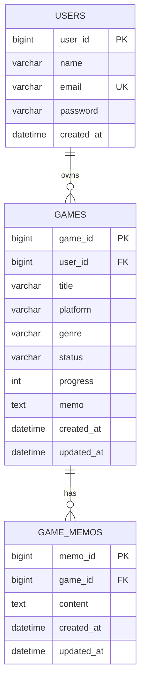
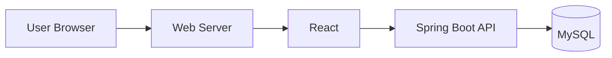

# 🎮 GameLog

> **ゲームの攻略情報とプレイ状況を、ひとつに。**

GameLogは、複数のゲームを遊ぶユーザー向けのゲーム管理アプリです。
ゲームごとの進行度・ステータス・攻略メモを管理し、「前回どこまで進めたか分からない」を解決します。

## 🔗 アプリURL
本番環境デプロイ後にここへURLを記載します。

## 👤 テストアカウント
本番環境で認証機能を有効にした場合、ここへ記載します。

## ✨ 主な機能

- ユーザー登録・ログイン
- ゲームの登録・編集・削除
- プレイステータス管理（プレイ中 / クリア / 積みゲー）
- 進行度 0〜100% 管理
- 攻略メモ管理
- ゲーム名・ジャンル検索
- ステータス絞り込み
- ダッシュボード集計
- ユーザーごとのゲームデータ管理

## 🖥️ 画面

1. ログイン画面
2. ダッシュボード
3. ゲーム一覧
4. ゲーム登録・編集
5. ゲーム詳細
6. 攻略メモ

### 📸 画面一覧

.png)

## 💡 開発背景

ゲームを複数本プレイしていると、「どこまで進めたか」「次に何をするか」「前に書いた攻略メモ」が分からなくなることがあります。

そこで、ゲームごとの情報を一か所にまとめ、再開時にすぐ状況を確認できるアプリを企画しました。

## 🛠️ 使用技術

### フロントエンド
- React
- Vite
- JavaScript
- HTML / CSS

### バックエンド
- Java
- Spring Boot
- Spring Data JPA
- Spring Security

### データベース
- MySQL

### インフラ / 開発環境
- Docker / Docker Compose
- Git / GitHub
- AWS（本番デプロイ時）

## 🗃️ ER図



## ☁️ インフラ構成図



AWSへデプロイする場合は、Web/API/DBを分離した構成へ発展させます。

## 🔌 API設計

| API | URL | Method | 内容 |
|---|---|---|---|
| ログイン | /api/auth/login | POST | ログイン |
| ゲーム一覧 | /api/games | GET | 自分のゲーム一覧 |
| ゲーム詳細 | /api/games/{id} | GET | 詳細取得 |
| ゲーム登録 | /api/games | POST | 新規登録 |
| ゲーム更新 | /api/games/{id} | PUT | 更新 |
| ゲーム削除 | /api/games/{id} | DELETE | 削除 |
| メモ一覧 | /api/games/{id}/memos | GET | 攻略メモ取得 |
| メモ登録 | /api/games/{id}/memos | POST | 攻略メモ登録 |

## 🚀 ローカル起動

### 1. DB起動

```bash
docker compose up -d db
```

### 2. Backend

```bash
cd backend
./mvnw spring-boot:run
```

### 3. Frontend

別ターミナルで、

```bash
cd frontend
npm install
npm run dev
```

ブラウザで表示されたURLを開きます。

## 📁 ディレクトリ

```text
GameLog/
├── frontend/
│   ├── src/
│   └── package.json
├── backend/
│   ├── src/
│   └── pom.xml
├── docs/
│   ├── requirements.md
│   └── api-design.md
├── docker-compose.yml
└── README.md
```

## 🎯 今後の改善

- AWSへのデプロイ
- 攻略サイトURL登録
- スクリーンショット登録
- お気に入り
- タグ検索
- ゲーム別プレイ時間
- モバイル表示の強化
